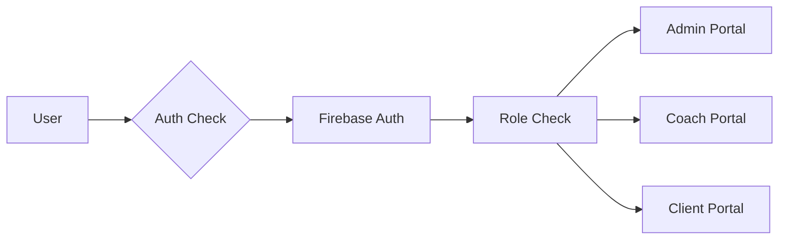
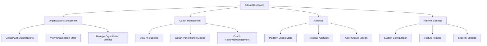
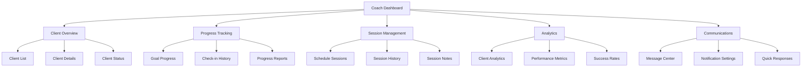
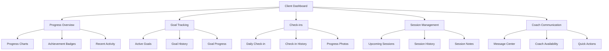
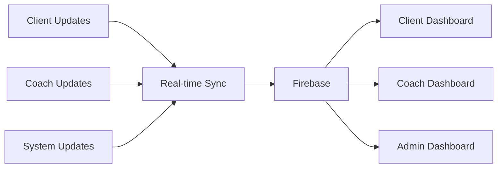

# ShadowCoach AI - Project Knowledge Base

## Project Overview
ShadowCoach AI is a comprehensive coaching platform that connects coaches with clients, providing tools for progress tracking, goal setting, and automated support through AI integration.

## Core Goals
1. Streamline coach-client interactions
2. Provide data-driven insights for better coaching
3. Automate routine tasks through AI
4. Enhance client motivation and engagement
5. Create scalable coaching solutions

## Tech Stack
- **Frontend**: Next.js 14.1.0, React, TailwindCSS
- **Backend**: Node.js, Firebase
- **Authentication**: Firebase Auth
- **Database**: Firebase Firestore
- **AI Integration**: OpenAI API
- **Analytics**: Firebase Analytics
- **Hosting**: Vercel

## Site Map

### Public Pages
- `/` - Landing page
- `/auth/login` - Login page
- `/auth/register` - Registration page
- `/about` - About page
- `/pricing` - Pricing plans
- `/contact` - Contact form

### Admin Portal
- `/admin/dashboard` - Admin overview
- `/admin/organizations` - Organization management
- `/admin/coaches` - Coach management
- `/admin/analytics` - Platform analytics
- `/admin/settings` - Platform settings

### Coach Portal
- `/coach/dashboard` - Coach overview
- `/coach/clients` - Client management
- `/coach/clients/[id]` - Individual client view
- `/coach/analytics` - Client analytics
- `/coach/sessions` - Session management
- `/coach/messages` - Client communications

### Client Portal
- `/client/dashboard` - Client overview
- `/client/goals` - Goal tracking
- `/client/check-ins` - Daily check-ins
- `/client/progress` - Progress tracking
- `/client/sessions` - Session scheduling
- `/client/messages` - Coach communications

## Data Flow

### Authentication Flow


### Dashboard Dataflows

#### Admin Dashboard Flow


#### Coach Dashboard Flow


#### Client Dashboard Flow


### Data Synchronization


### Real-time Updates
```typescript
interface RealTimeUpdate {
  type: 'progress' | 'check-in' | 'message' | 'goal' | 'session';
  userId: string;
  timestamp: Date;
  data: any;
  recipients: string[];
  priority: 'high' | 'medium' | 'low';
}

interface DashboardMetrics {
  lastUpdated: Date;
  dataVersion: number;
  cacheStatus: 'fresh' | 'stale' | 'updating';
  lastSync: Date;
}
```

### Data Refresh Strategy
```typescript
interface RefreshStrategy {
  // Real-time updates
  realtime: {
    progress: true;
    messages: true;
    checkIns: true;
  };
  
  // Periodic updates
  periodic: {
    analytics: '5m';
    metrics: '15m';
    reports: '1h';
  };
  
  // On-demand updates
  onDemand: {
    fullSync: boolean;
    forceRefresh: boolean;
    clearCache: boolean;
  };
}
```

### Core Data Models
```typescript
interface User {
  id: string;
  email: string;
  role: 'admin' | 'coach' | 'client';
  profile: UserProfile;
  settings: UserSettings;
}

interface Organization {
  id: string;
  name: string;
  coaches: string[];
  clients: string[];
  settings: OrganizationSettings;
}

interface Coach {
  id: string;
  userId: string;
  organizationId: string;
  specialties: string[];
  clients: string[];
  availability: Availability[];
}

interface Client {
  id: string;
  userId: string;
  coachId: string;
  organizationId: string;
  goals: Goal[];
  progress: Progress[];
  checkIns: CheckIn[];
}

interface Goal {
  id: string;
  clientId: string;
  type: GoalType;
  target: number;
  deadline: Date;
  progress: number;
  status: GoalStatus;
}

interface CheckIn {
  id: string;
  clientId: string;
  date: Date;
  mood: number;
  progress: string;
  challenges: string;
  metrics: Record<string, number>;
}

interface Session {
  id: string;
  coachId: string;
  clientId: string;
  date: Date;
  duration: number;
  status: SessionStatus;
  notes: SessionNotes;
}
```

## Features Built

### Admin Dashboard
- Organization management
- Coach management
- Analytics dashboard
- Platform overview

### Coach Dashboard
- Client overview
- Progress tracking
- Session management
- Analytics dashboard
- Client communications

### Client Dashboard
- Progress overview
- Goal tracking
- Daily check-ins
- Achievement system
- Progress visualization
- Coach communication

## To-Do List

### High Priority
1. **Authentication System**
   - [ ] Complete Firebase integration
   - [ ] Role-based access control
   - [ ] Password reset flow

2. **Core Functionality**
   - [ ] Session scheduling system
   - [ ] Notification system
   - [ ] File upload for progress photos
   - [ ] Real-time chat

3. **Data Management**
   - [ ] Database schema implementation
   - [ ] API endpoints
   - [ ] Data validation
   - [ ] Error handling

### Medium Priority
1. **Enhanced Features**
   - [ ] Custom goal templates
   - [ ] Progress report generation
   - [ ] Automated check-in reminders
   - [ ] Integration with fitness apps

2. **Analytics**
   - [ ] Advanced metrics
   - [ ] Custom reports
   - [ ] Data visualization
   - [ ] Export functionality

### Low Priority
1. **Additional Features**
   - [ ] Mobile app
   - [ ] Email templates
   - [ ] Blog system
   - [ ] Resource library

## AI Integrations to Consider

### Current Plan
1. **Chat Support**
   - OpenAI GPT-4 for automated responses
   - Context-aware suggestions
   - 24/7 basic support

2. **Progress Analysis**
   - Pattern recognition in client data
   - Trend analysis
   - Predictive insights

3. **Content Generation**
   - Personalized workout plans
   - Nutrition recommendations
   - Progress reports

### Future Possibilities
1. **Advanced Analysis**
   - Computer vision for form checking
   - Voice analysis for sentiment
   - Behavioral pattern recognition

2. **Personalization**
   - Custom motivation messages
   - Adaptive goal setting
   - Learning from successful clients

3. **Automation**
   - Schedule optimization
   - Task prioritization
   - Client matching

## MVP Recommendations

### Phase 1 (Launch MVP)
1. **Core Features**
   - User authentication
   - Basic profiles
   - Goal setting
   - Check-in system
   - Progress tracking
   - Basic messaging

2. **Essential AI**
   - Basic chat support
   - Simple progress analysis
   - Automated check-in reminders

3. **Analytics**
   - Basic progress tracking
   - Simple reporting
   - Key metrics dashboard

### Phase 2 (First Major Update)
1. **Enhanced Features**
   - Advanced goal tracking
   - Custom templates
   - File uploads
   - Real-time chat

2. **AI Improvements**
   - Enhanced chat capabilities
   - Pattern recognition
   - Personalized recommendations

3. **Analytics Upgrade**
   - Advanced metrics
   - Custom reports
   - Data visualization

## Development Guidelines

### Code Structure
- Use TypeScript for type safety
- Follow Next.js best practices
- Implement proper error handling
- Write comprehensive tests

### UI/UX Principles
- Mobile-first design
- Accessible components
- Consistent styling
- Clear navigation

### Security Measures
- Regular security audits
- Data encryption
- GDPR compliance
- Regular backups

## Monitoring & Maintenance

### Performance Metrics
- Page load times
- API response times
- Error rates
- User engagement

### Regular Tasks
- Security updates
- Dependency updates
- Performance optimization
- User feedback review

## Future Considerations

### Scalability
- Microservices architecture
- Load balancing
- Caching strategies
- Database optimization

### Integration Possibilities
- Fitness tracking devices
- Nutrition apps
- Calendar systems
- Payment processors

### Business Growth
- White-label solutions
- API access
- Partner integrations
- Enterprise features

## Notes
- Keep user privacy as a top priority
- Focus on mobile responsiveness
- Maintain clear documentation
- Regular security audits
- Performance optimization
- Regular backups
- User feedback collection 